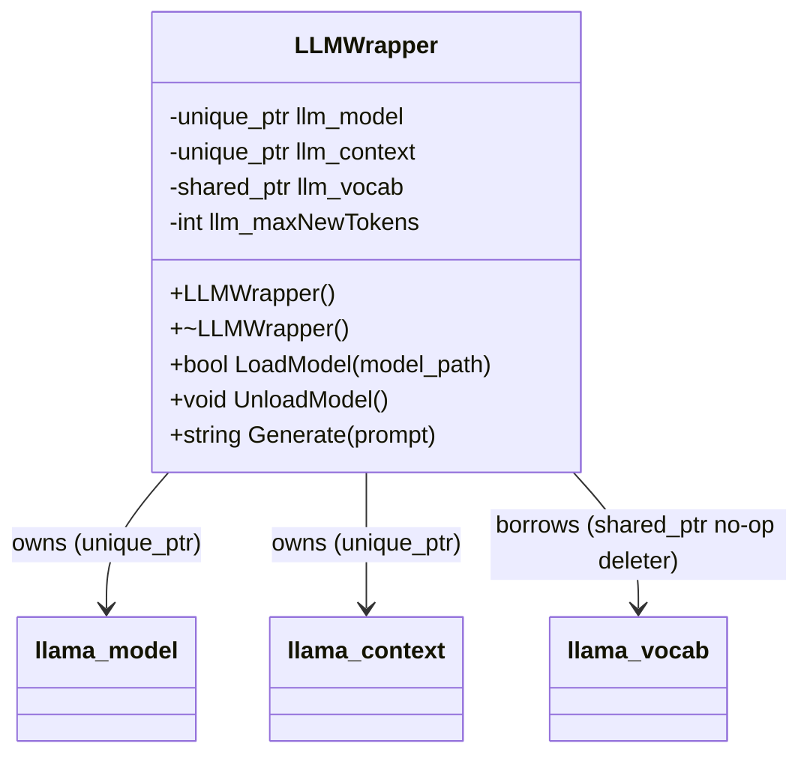
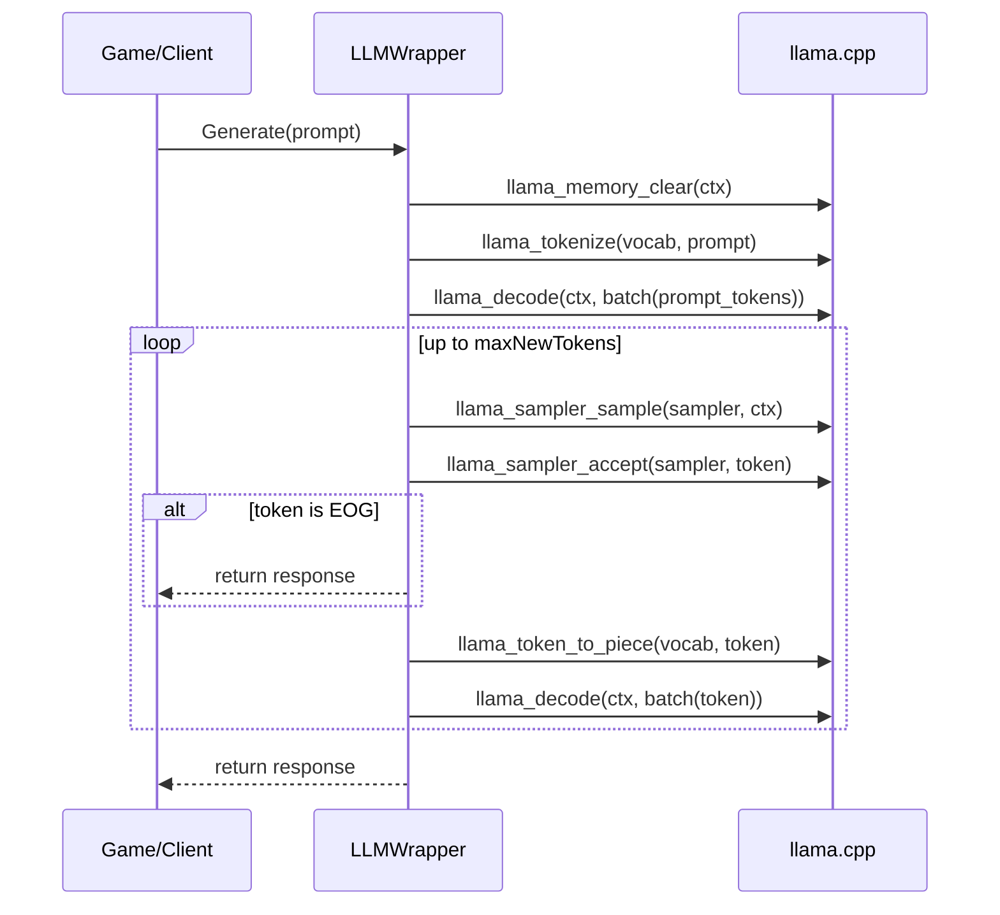

# Technical Design: `fyp-llm-library`

This document describes the internal structure of this repository and the design of the `LLMWrapper` class used to run local LLM inference inside a game.

> Scope note: The `external/llama.cpp` directory is a git submodule dependency. This document treats it as a third-party engine and focuses on this repo’s integration and wrapper layer.

## 1. Goals and constraints

### Goals

- Provide a **minimal**, game-friendly C++ API for local text generation.
- Hide `llama.cpp` C API details behind a small wrapper.
- Make integration into another CMake-based project straightforward.
- Keep resources (model/context/sampler) cleaned up safely.

### Non-goals (current)

- Chat history and multi-turn conversation management.
- Streaming token callbacks (e.g., printing tokens as they are generated).
- Multi-context batching for high throughput.
- GPU/offload auto-configuration.

### Constraints driving design

- Games tend to prefer **simple, synchronous APIs** at first.
- `llama.cpp` is a C API with manual lifetime management; the wrapper should provide RAII.
- Model files are large and should be loaded once at startup where possible.

## 2. Architecture overview

### Key components

- `LLMWrapper` (`llm/LLMWrapper.h`, `llm/LLMWrapper.cpp`)
  - Owns/coordinates `llama_model`, `llama_context`, and the model vocab.
  - Provides `LoadModel()`, `UnloadModel()`, `Generate()`.
- `LLMLib` (CMake target)
  - Static library exposing `LLMWrapper`.
- `LLMTest` (CMake executable + VS project)
  - Smoke test that loads a local model and generates a short line.
- `resources/scripts/download_model.py`
  - Downloads a default GGUF model.

### High-level data flow

## 3. Public API

### `LLMWrapper`

From `llm/LLMWrapper.h`:

- `bool LoadModel(const std::string& model_path)`
  - Loads a GGUF file into a `llama_model`.
  - Creates a `llama_context` with chosen parameters.
  - Caches a pointer to the model vocab.

- `void UnloadModel()`
  - Releases owned model/context resources.

- `std::string Generate(const std::string& prompt)`
  - Clears model KV cache so each call is “fresh”.
  - Tokenizes + decodes prompt.
  - Runs a sampling loop to create new tokens.
  - Detokenizes tokens to a final output string.

## 4. UML diagrams

### 4.1 Class diagram

### 4.2 Sequence diagram: generation

## 5. Subsystems and why they exist

### 5.1 Backend lifetime subsystem (`EnsureLlamaBackendInit`)

Location: anonymous namespace in `llm/LLMWrapper.cpp`.

Purpose:
- `llama_backend_init()` must be called before using `llama.cpp`.
- The wrapper ensures init happens **exactly once per process**.

Implementation:
- Uses `std::once_flag` + `std::call_once` for thread-safe one-time initialization.
- Registers `llama_backend_free()` using `std::atexit` so the backend is freed when the process exits.

Justification:
- Avoids global state ordering issues.
- Allows multiple `LLMWrapper` instances without double-init.

### 5.2 Resource management subsystem (RAII wrappers)

Location: `llm/LLMWrapper.h`.

Purpose:
- `llama.cpp` uses manual `*_free()` functions.
- The wrapper uses RAII to guarantee cleanup in normal execution and on early returns.

Key design choices:

1) `std::unique_ptr` with custom deleters
- `llm_model` is a `std::unique_ptr<llama_model, LLamaModelDeleter>`.
- `llm_context` is a `std::unique_ptr<llama_context, LlamaContextDeleter>`.

Why `unique_ptr`:
- There is a single clear owner of the model/context: the wrapper instance.
- Prevents accidental copies.

Why custom deleters:
- There are no default destructors for these C types; they must be freed with specific API calls so I had to make these.
- These types must be freed using `llama_model_free()` and `llama_free()` (not `delete`).

2) `std::shared_ptr` for vocab
- `llama_model_get_vocab()` returns a pointer owned by the model.
- The wrapper stores it as a `std::shared_ptr<const llama_vocab>` with a **no-op deleter**.

Why `shared_ptr` here:
- Initially this was a unique_ptr but eventually caused an error where the destructor tried to free the vocab pointer which is owned by the model, not the wrapper. A shared_ptr allows the wrapper to hold a reference to the vocab without implying ownership or responsibility for cleanup. 
- The purpose of a no-op deleter is to prevent the shared_ptr from trying to free the vocab pointer when it goes out of scope, since the vocab is owned by the model and will be freed when the model is freed.
- It lets the code pass around a vocab “handle” safely without implying ownership.
- It also makes helper functions (that accept a `shared_ptr`) easy to call.

Caveat:
- The vocab pointer is only valid while the model is alive; `UnloadModel()` clears it.

### 5.3 Prompt processing subsystem (tokenization + prompt decode)

Tokenization:
- Uses `std::vector<llama_token>` as the dynamic buffer.
- Calls `llama_tokenize()` once and resizes if the API returns a negative count (meaning “buffer too small”).

Why `std::vector`:
- Contiguous storage required by the C API.
- Resizable when the token count is unknown.

Prompt decoding:
- `DecodeTokensInChunks()` decodes the prompt in chunks of size `llama_n_batch(ctx)`.

Why chunking exists:
- Prompts can be longer than the context’s preferred batch size.
- Chunked decoding avoids exceeding batch limits and provides predictable memory usage.

Why a `while` loop:
- The prompt length is not known at compile time.
- The algorithm naturally progresses by incrementing an index until all tokens are decoded.

### 5.4 Sampling subsystem

Current implementation:
- Creates a sampler chain via `llama_sampler_chain_init()`.
- Adds a greedy sampler with `llama_sampler_init_greedy()`.

Why greedy sampling:
- It is the simplest baseline and deterministic for a fixed prompt/model.

Extension points:
- Replace or extend with temperature/top-k/top-p samplers in the chain.

### 5.5 Detokenization subsystem

- `TokenToString()` calls `llama_token_to_piece()` to convert each generated token into a text “piece”.
- Uses a small initial buffer (`std::vector<char>(64)`) and resizes if needed.

Why the resize logic:
- `llama_token_to_piece()` can indicate required size.
- Resizing avoids truncating token text.

## 6. Build system design

### 6.1 CMake

Root `CMakeLists.txt`:
- Adds `external/llama.cpp` via `add_subdirectory()`.
- Builds `LLMLib` as a static library from `llm/LLMWrapper.*`.
- Builds `LLMTest` and links it against `LLMLib`.
- Defines `FYP_SOURCE_DIR` for `LLMTest` so it can locate `resources/downloaded_resources`.

### 6.2 Visual Studio projects

`vs/LLMLib/` contains MSBuild projects that compile the wrapper and `llama.cpp` directly.

Rationale:
- Easier for some users to build/run inside Visual Studio without using the CMake command line.

## 7. Current limitations and potential future extensions

Limitations (by design / current scope):
- Synchronous, blocking generation call.
- KV cache cleared each call.
- Greedy sampling only.
- CPU-only by default.

Potential areas of extension:
- Add generation parameters (max tokens, temperature, top-k/top-p).
- Add streaming callback (emit pieces as they are generated).
- Add optional “conversation mode” that retains KV cache between calls.
- Add a thread-safe queue + background inference thread for games.
